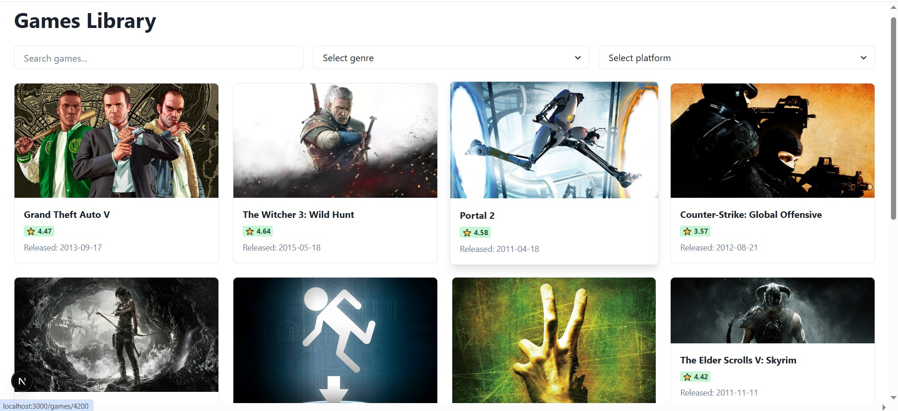
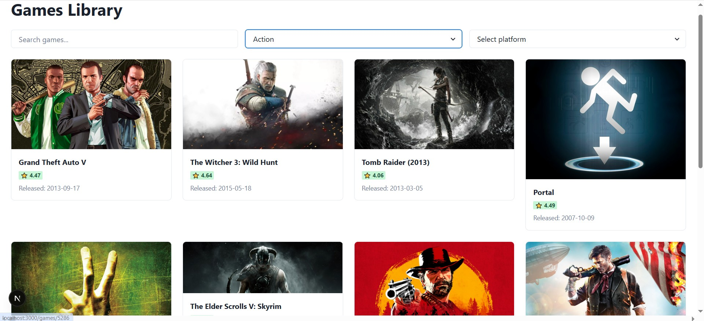
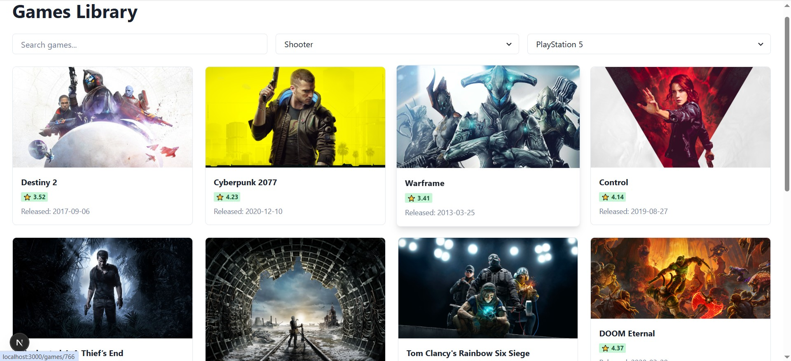
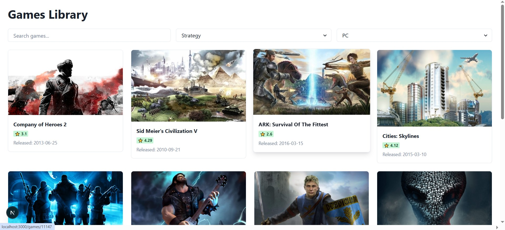
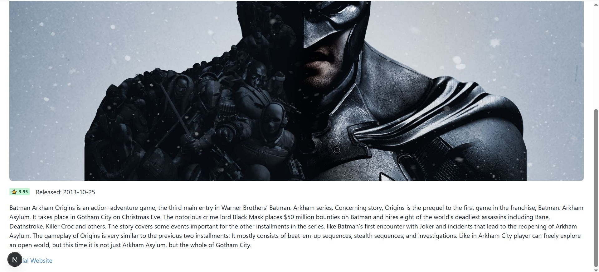

🎮 Gaming Products UI

A modern gaming products interface built with Next.js 16, React, TypeScript, and Tailwind CSS v4, powered by the RAWG API.

🚀 Live Features

🔥 Modern UI built with Tailwind CSS v4

⚡ Next.js 16 App Router

🎮 Dynamic game listing from RAWG API

📄 Game detail pages

🔍 Pagination support

🌙 Clean, responsive layout

🛡 API proxy for secure API key handling

🧠 TypeScript for type safety

🏗 Tech Stack

Framework: Next.js 16 (App Router)

UI Library: React

Styling: Tailwind CSS v4

Language: TypeScript

API: RAWG

📸 Screenshots

Add screenshots like this:

## Screenshots

📂 Project Structure

src/
 ├── app/
 │    │
 │    │          
 │    ├── games/
 │    │    ├── page.tsx            # Games list page
 │    │    └── [id]/page.tsx       # Game details page
 │    ├── layout.tsx
 │    └── globals.css
 │
 ├── components/
 │    └── games/
 │         └── GameCard.tsx
 │
 ├── hooks/
 │    └── useGames.ts
 │
 └── services/
      └── api.ts

⚙️ Installation

Clone the repository:

git clone https://github.com/parsabdr-dev/gaming-products-UI-with-next.js-and-react.js.git
cd gaming-products-UI-with-next.js-and-react.js

Install dependencies:

npm install

🔑 Environment Variables

Create a .env.local file in the root directory:

NEXT_PUBLIC_RAWG_KEY=your_rawg_api_key_here(mine was "069a66b858094120a5d46eefddb2a5f1")

Get your free API key from:
👉 https://rawg.io/apidocs

▶️ Run Development Server
npm run dev

Open:

http://localhost:3000

      
🎨 Styling (Tailwind CSS v4)

Tailwind v4 uses the new simplified setup:

globals.css:

@import "tailwindcss";

postcss.config.js:

module.exports = {
  plugins: {
    "@tailwindcss/postcss": {},
  },
}

📈 Future Improvements

🔎 Search functionality

🎛 Filter by genre/platform

⭐ Rating system

♾ Infinite scroll

🌙 Dark mode toggle

🧪 Unit & integration testing

🧠 What I Learned

Working with external APIs

Handling rate limits and timeouts

Using Next.js App Router properly

Building server-side API proxies

Managing environment variables securely

Structuring scalable React projects

🛡 Error Handling Strategy

The project handles:

API timeout errors

Rate limit errors

Network instability

Graceful UI fallback (Failed to load games state)

📌 Author

Parsa Badri
Computer Engineering Graduate
Passionate about Frontend & AI Development

GitHub:
https://github.com/parsabdr-dev
